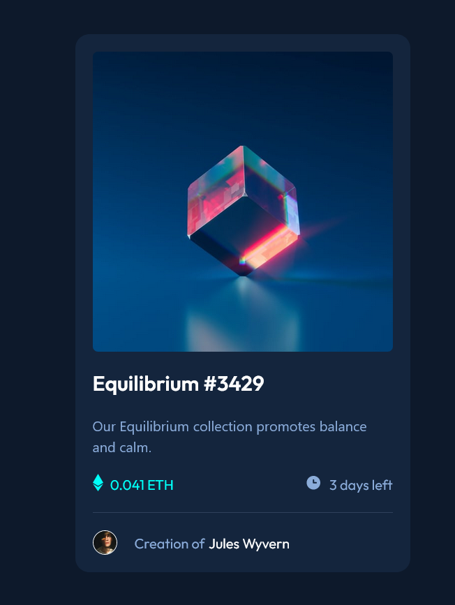

# Frontend Mentor - NFT preview card component solution

This is a solution to the [NFT preview card component challenge on Frontend Mentor](https://www.frontendmentor.io/challenges/nft-preview-card-component-SbdUL_w0U). Frontend Mentor challenges help you improve your coding skills by building realistic projects.

## Table of contents

- [Overview](#overview)
  - [The challenge](#the-challenge)
  - [Screenshot](#screenshot)
  - [Links](#links)
- [My process](#my-process)
  - [Built with](#built-with)
  - [What I learned](#what-i-learned)
  - [Continued development](#continued-development)
  - [Useful resources](#useful-resources)
- [Author](#author)

**Note: Delete this note and update the table of contents based on what sections you keep.**

## Overview

### The challenge

Users should be able to:

- View the optimal layout depending on their device's screen size
- See hover states for interactive elements

### Screenshot

### Links

- Solution URL: [Frontend Mentor](https://www.frontendmentor.io/solutions/nft-preview-card-component-using-nextjs-and-tailwindcss-xr4RGqq51-)
- Live Site URL: [Vercel](https://nft-preview-card-murex.vercel.app/)

## My process

### Built with

- Next.js
- Tailwindcss
- Flexbox
- Mobile-first workflow
- [Next.js](https://nextjs.org/) - React framework

### What I learned

I learned how to make a tailwind styled component non-responsive so it looks the same on mobile and desktop, by using a fixed width style like w-96 in the top level div.

### Continued development

In future projects, I want to use props if the project has multiple components that are similar.

### Useful resources

- [Tailwind CSS Documentation](https://tailwindcss.com/docs/installation) - This is a must to have open while developing to look up what tailwind classes are available.

## Author

- Github - [ironcladmerc](https://github.com/ironcladmerc)
- Frontend Mentor - [@ironcladmerc](https://www.frontendmentor.io/profile/ironcladmerc)
- Twitter - [@MikeRay12345](https://www.twitter.com/@MikeRay12345)
